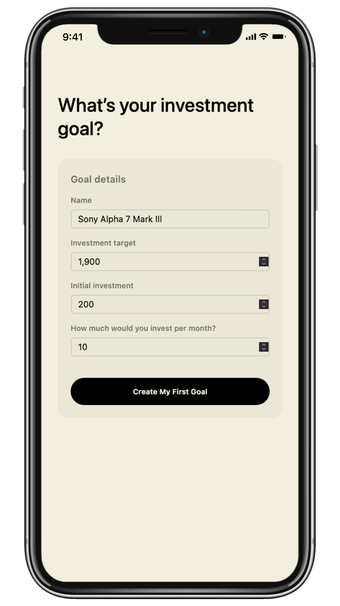
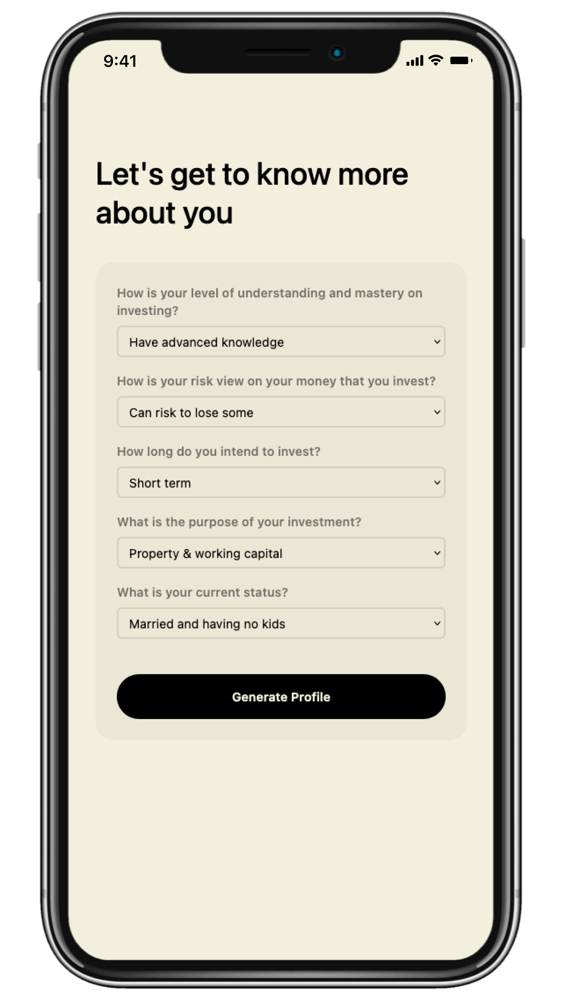
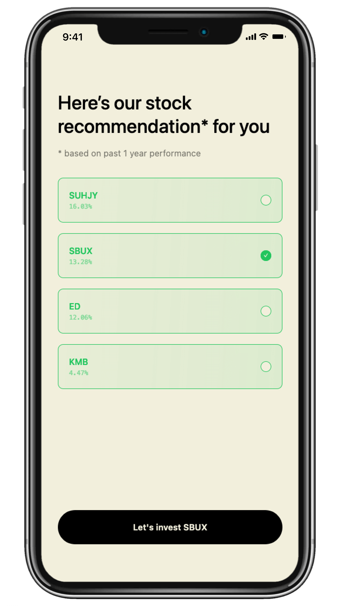
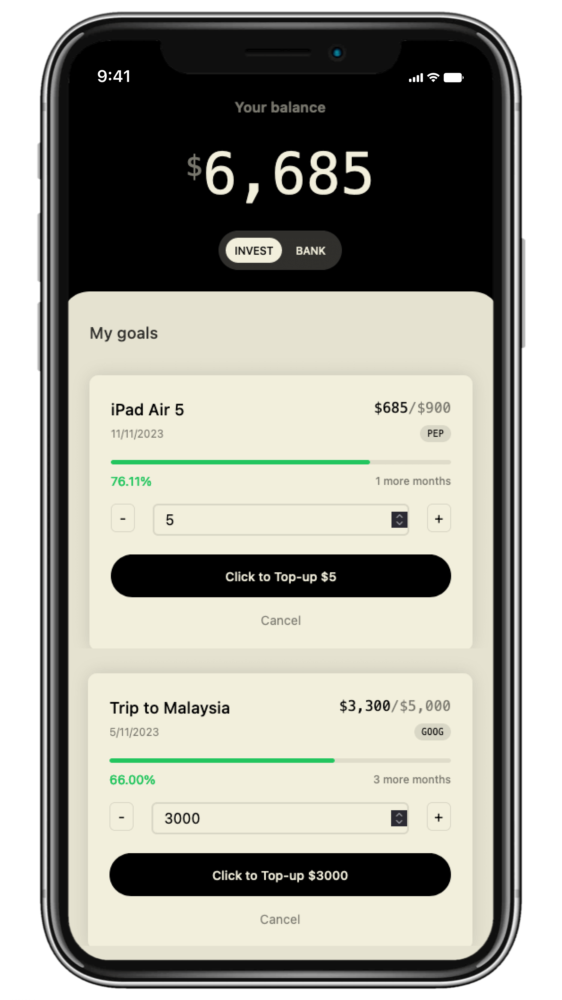

<p align="center">

</p>
<h1 align="center">Upvest</h1>

## Description

Online investing platform with ML-based micro-investment tracker. UpVest let users can make its initial investment, then UpVest will manage their funds, with integrated system to RHB bank account. UpVest has three unique selling points, namely automated risk profiling feature to personalize stock recommendation for user, goal-based investment to trigger more fun investment activity, and real-time stock performance updates to provide daily advice.

## Preview

<p float="left">
   
  
  
  
  
</p>

## Demo

### Local

Open terminal and then type here

```bash
npm install
npm run dev
```

and open [http://localhost:3000](http://localhost:3000) with your browser to see the result.

### Global

Open the live demo [here](https://upvest.vercel.app)
